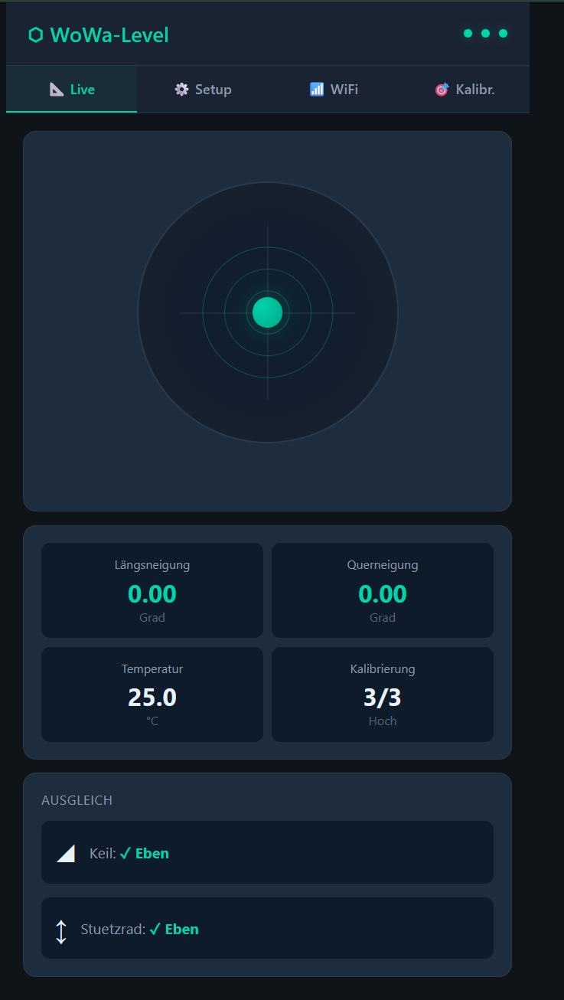
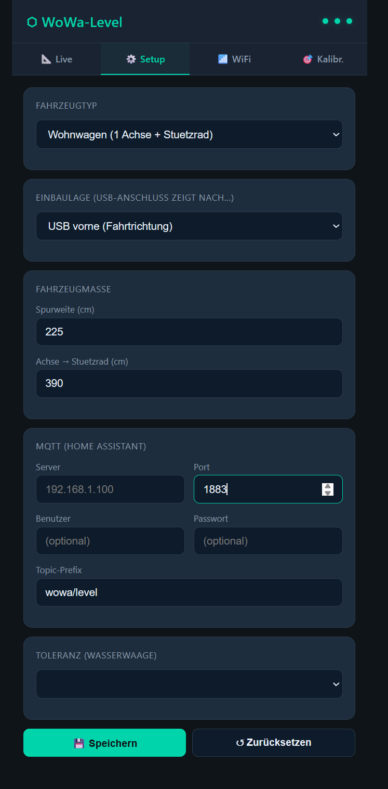
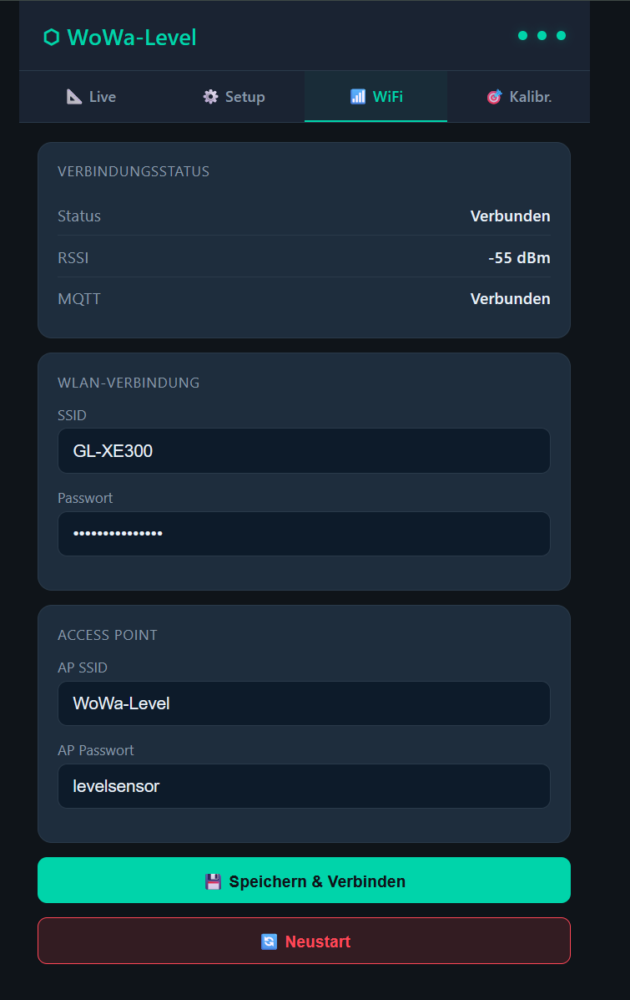
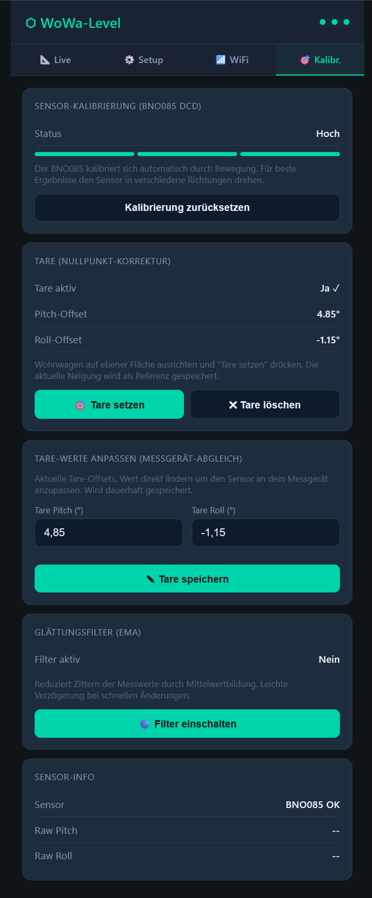
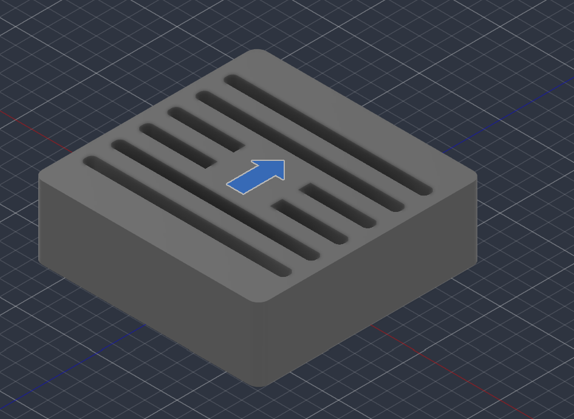
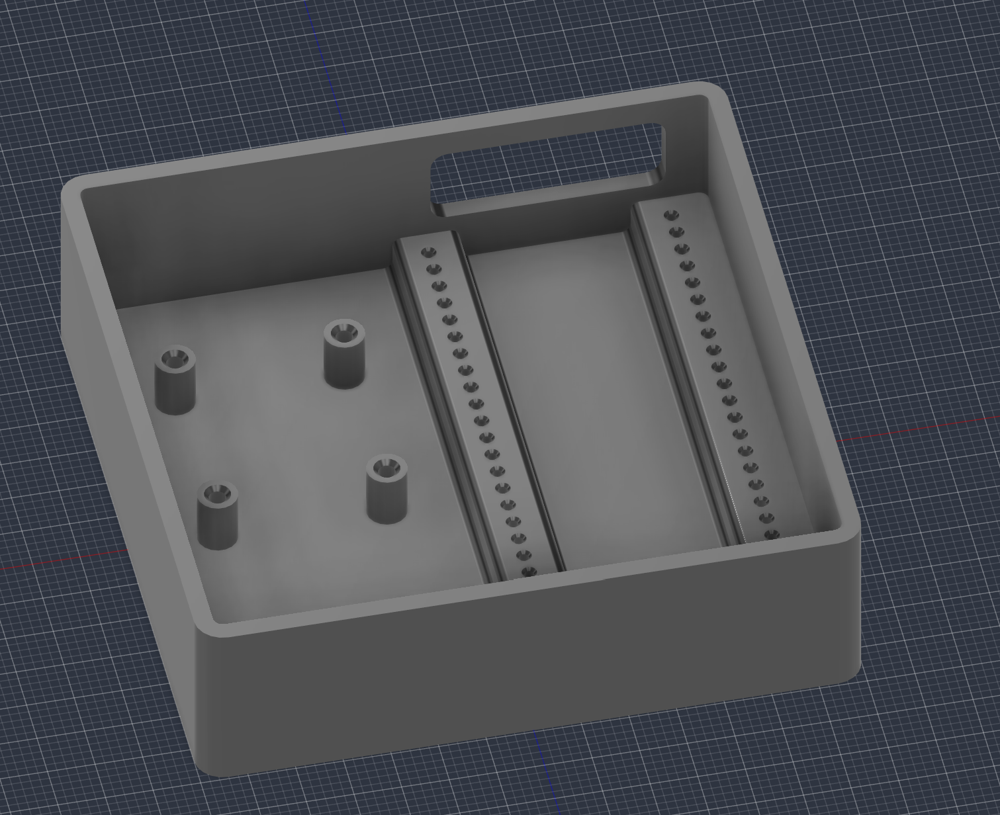
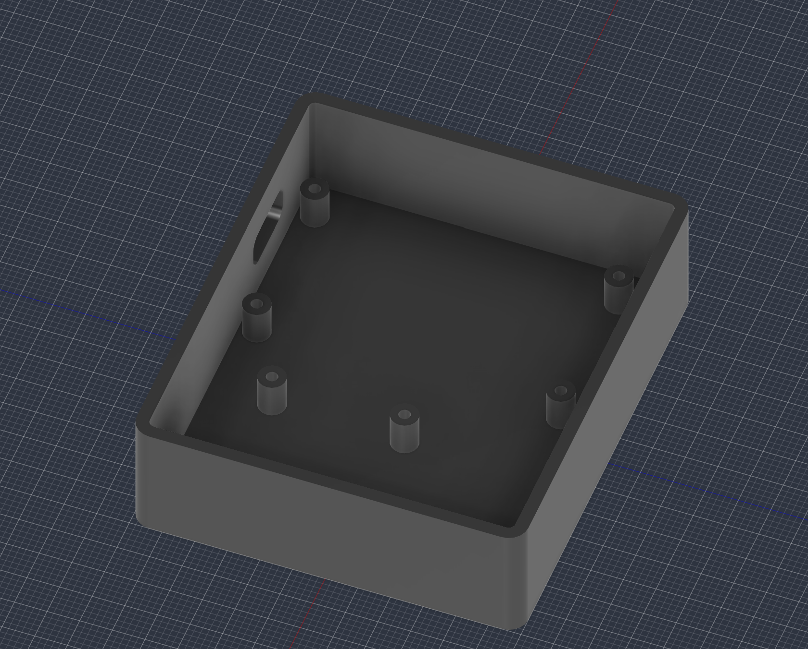
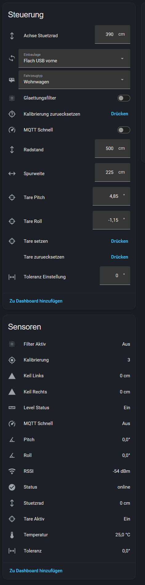
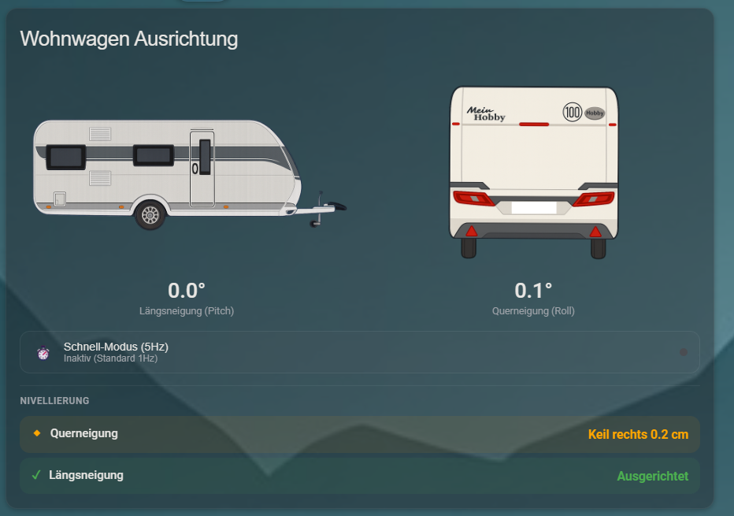

# WoWa-Level – Wohnwagen/Wohnmobil Neigungssensor

Präziser DIY-Neigungssensor zum Nivellieren von Wohnwagen und Wohnmobilen, mit interaktiver Web-UI, Echtzeit-Wasserwaage und Home-Assistant-Anbindung inkl. Feinjustierung.

<p align="center">
  
  
</p>
<p align="center">
  
  
</p>

---

## Hardware

- **MCU:** ESP32-S3 DevKit
- **IMU:** Adafruit BNO085 9-DoF Breakout (#4754), angebunden über **I2C**
- **Stromversorgung:** USB-C oder 5V/VIN

> **Hinweis:** Das Projekt setzt auf den ESP32-S3. Dieser bietet im Vergleich zu kleineren Controllern eine stabilere Spannungsversorgung unter WiFi-Sende-Peaks und ausreichend Ressourcen für den parallelen Betrieb von WebServer, WebSocket-Streaming und MQTT.

## Pin-Belegung (I2C)

| ESP32-S3 | BNO085 | Funktion |
| --- | --- | --- |
| GPIO1 | SDA | I2C Data |
| GPIO2 | SCL | I2C Clock |
| 3V3 (oder VIN/5V) | VIN | Versorgung |
| GND | GND | Masse |

## 3D-Druck / Gehäuse

Im Ordner [`3D-Print/`](./3D-Print) findest du druckfertige STL-Dateien sowie Vorschaubilder für zwei verschiedene Gehäusevarianten:

- **ESP32-S3 Variante:** `Gehäuse ESP32-S3.stl`, `Deckel ESP32-S3.stl`, `Pfeil ESP32-S3.stl`
- **Standard ESP32-DevKit Variante:** `Gehäuse.stl`, `Deckel.stl`, `Pfeil.stl`

<p align="center">
  
  
  
</p>

## Arduino IDE Setup

### Board

- **Board Manager URL:** `https://raw.githubusercontent.com/espressif/arduino-esp32/gh-pages/package_esp32_index.json`
- **Board:** ESP32S3 Dev Module
- **Flash Size:** 4MB (oder entsprechend dem Modul)
- **Partition Scheme:** Default 4MB with spiffs / LittleFS

### Benötigte Libraries (Library Manager)

1. **SparkFun BNO08x Cortex Based IMU** (by SparkFun)
2. **PubSubClient** (by Nick O'Leary)
3. **ArduinoJson** (by Benoit Blanchon) – Version 7.x
4. **ESPAsyncWebServer** (ESP32Async-Fork)
5. **AsyncTCP** (ESP32Async-Fork)

## Features

- ✅ **BNO085 Accelerometer-Modus:** Driftarm, kein Gyro-Drift, temperaturkompensiert.
- ✅ **Fahrzeugtypen:** Wohnwagen (1 Achse + Stützrad) oder Wohnmobil (2 Achsen, 4 Keile).
- ✅ **Tare-Funktion (Nullpunkt):** Nullpunkt-Kalibrierung mit Speicherung im NVS/Flash.
- ✅ **Tare-Feinjustierung (Fine Offset):** Nachträgliche Korrektur der Pitch- und Roll-Werte (±5.00° in 0.05°-Schritten) über Live-Slider in der Web-UI sowie interaktive `number`-Entitäten in Home Assistant.
- ✅ **Keil-Berechnung:** Errechnet präzise Höhenänderungen in cm für Radkeile und Stützrad (Spurweite / Radstand / Achsabstand konfigurierbar).
- ✅ **Glättungsfilter & Totzone:** Rauschunterdrückung gegen Zittern der Anzeige.
- ✅ **WiFi Manager:** Verlässlicher Connect mit AP-Fallback (`WoWa-Level-AP`) und deaktiviertem WiFi-Power-Save für maximale Stabilität.
- ✅ **MQTT & Home Assistant Auto-Discovery:** Automatische Einbindung aller Sensoren und Bedienelemente inkl. Last-Will-Entdeckung.
- ✅ **Echtzeit Web-UI:** Integrierte responsive Live-Wasserwaage via Websocket, Tabs für Live-Anzeige, Kalibrierung/Feinjustierung und Einstellungen.

## Home Assistant Integration



- **Sensoren:** Pitch, Roll, Keilkorrekturen (Links, Rechts, Stützrad bzw. 4 Keile), Temperatur.
- **Number-Entitäten (Regler):** 
  - `Pitch Feinjustierung` (`-5.0°` bis `+5.0°`, Schrittweite `0.05°`)
  - `Roll Feinjustierung` (`-5.0°` bis `+5.0°`, Schrittweite `0.05°`)
- **Buttons / Switches:** Tare setzen, Tare zurücksetzen, Filter Umschaltung.

> Eine passende Dashboard-Karte befindet sich im Ordner [`WoWa-Level-Card/`](./WoWa-Level-Card).



## MQTT Topics (Prefix: `wowa/level`)

| Topic | Typ | Beschreibung |
| --- | --- | --- |
| `.../pitch` | Sensor | Längsneigung in Grad |
| `.../roll` | Sensor | Querneigung in Grad |
| `.../fine_pitch/state` | State | Aktueller Fine Offset Pitch (Grad) |
| `.../fine_pitch/set` | Command | Fine Offset Pitch setzen (-5.00 bis +5.00) |
| `.../fine_roll/state` | State | Aktueller Fine Offset Roll (Grad) |
| `.../fine_roll/set` | Command | Fine Offset Roll setzen (-5.00 bis +5.00) |
| `.../temperature` | Sensor | Temperatur in °C |
| `.../status` | LWT | `online` / `offline` |
| **Wohnwagen:** | | |
| `.../wedge_left`, `.../wedge_right` | Sensor | Keilhöhe links/rechts (cm) |
| `.../jockey_wheel` | Sensor | Stützrad-Korrektur (cm) |
| **Wohnmobil:** | | |
| `.../wedge_fl`, `.../wedge_fr`, `.../wedge_rl`, `.../wedge_rr` | Sensor | 4 Keile (cm) |

## Erstbenutzung & Kalibrierung

1. **Erstverbindung:** Nach dem ersten Flashen startet der ESP im AP-Modus. Verbinde dich mit dem WLAN `WoWa-Level-AP` (Passwort: `12345678`) und öffne `http://192.168.4.1`.
2. **Einbau & Tare:** Richte das Fahrzeug grob aus und drücke in der Web-UI unter **🎯 Kalibr.** den Button **Tare Setzen**.
3. **Feinjustierung:** Überprüfe das Ergebnis mit einer analogen Referenz-Wasserwaage (z. B. auf der Küchenzeile). Gleiche verbleibende Abweichungen komfortabel über die Schieberegler **Pitch Korrektur** und **Roll Korrektur** in der Web-UI oder direkt in Home Assistant ab.
4. **Speichern:** Klicke auf **Feinjustierung Speichern**, um die Offsets dauerhaft im Flash abzulegen.

## Projektstruktur

```text
.
├── 3D-Print/              – STL-Druckdateien und Vorschaubilder (ESP32-S3 & DevKit)
├── data/                  – Dateisystem für LittleFS (enthält index.html)
├── pictures/              – Screenshots für Web-UI und Home Assistant
├── WoWa-Level-Card/       – Lovelace Dashboard Card Ressourcen für Home Assistant
├── config.h               – Systemkonfiguration & Datenstrukturen
├── mqtt_ha.h / .cpp       – MQTT Client & Home Assistant Auto-Discovery
├── sensor.h / .cpp        – BNO085 Ansteuerung, Winkelberechnung & Offsets
├── webserver.h / .cpp     – Webserver, REST-API & WebSocket Broadcast
├── wifi_manager.h / .cpp  – WLAN-Verbindungssteuerung & AP-Fallback
└── wowa_level.ino         – Hauptsketch (Setup & Hauptschleife)